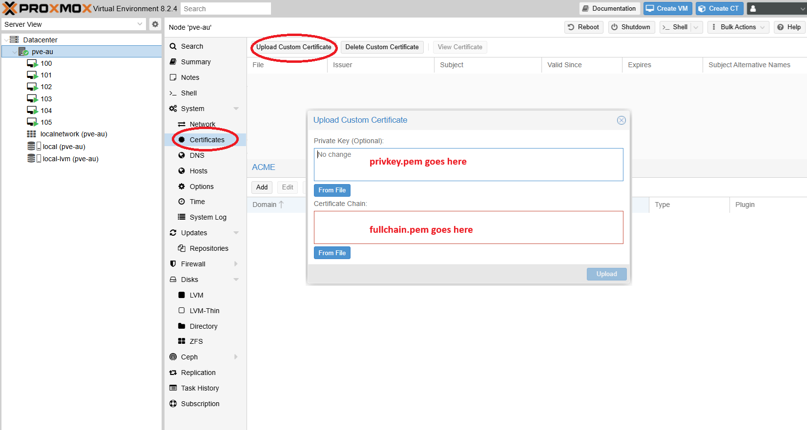

# Certbot with Proxmox

## Context
Proxmox has multiple ways to create certificates. For simplicity this method focuses on creating a wildcard certificate for your public domain using certbot, and then uploading the files to Proxmox.

## How can you use certbot instead
Certbot can be used to fetch SSL certificates, by confirming ownership of the domain. Private IPs will work fine here, but the domain needs to be public. 
In fact a public DNS record pointing to your host IP is not required at all. The only requirement for verifying domain ownership is creation of a specific TXT record. This is known as the manual method, and requires a specific command.

## Requirements
- You need certbot installed
- You need a public DNS zone you can create records on

## Instructions
Use this command syntax below, and replace the hostname with your own server hostname. This is the name you will use to connect to your Gitlab server.

1. Install certbot on a server, it can be any server, not necessary your Proxmox server
2. Run this command to start the process

`certbot certonly --manual -d *.mydomain.com`

3. Certbot will ask you questions, and eventually give you an output similar to 
```
Please deploy a DNS TXT record under the name:

_acme-challenge.dnsif.ca.

with the following value:

vqcwGUeQVgpfu-D_TIgHobOZ44o7wUUsSpT9nJBKKs4
```
4. Create the TXT record on your public domain, as requested by certbot

5. Hit Enter to continue on certbot

6. Certbot will verify the DNS record and give you this output
```
Successfully received certificate.
Certificate is saved at: /etc/letsencrypt/live/dnsif.ca/fullchain.pem
Key is saved at:         /etc/letsencrypt/live/dnsif.ca/privkey.pem
This certificate expires on 2024-10-01.
These files will be updated when the certificate renews.
```
6. Grab the 2 certificate files 

- `/etc/letsencrypt/live/dnsif.ca/fullchain.pem`
- `/etc/letsencrypt/live/dnsif.ca/privkey.pem`

7. Upload the certificates to Proxmox at the Web interface
- Go to the page for System > Certificates
- Upload privkey.pem to the _Private Key_ box
- Upload fullchain.pem to the _Certificate Chain_ box

8. Screenshot showing proxmox web interface, certificates page



9. Proxmox will restart the APi service automatically


10. Log in to the web interface using a DNS name from the same domain as the certificate (create one if you don't have one)

Your certificates are now installed.
