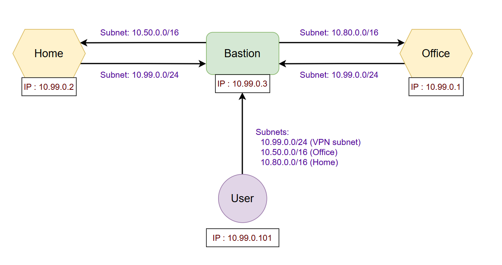

## How to Set Up WireGuard Bidirectional Subnet Sharing

This guide details how to establish a secure, bidirectional connection between your home and office networks using WireGuard, mediated by a bastion server in a public cloud. This setup allows devices on both networks to communicate with each other, even without exposed public IPs at home or the office. We assume your office network is on 10.50.0.0/16 and your home network is on 10.80.0.0/16.

### Context

We will be setting up WireGuard on several nodes:

- **Office Server:** A machine (PC or VM) on your office network.
- **Home Server:** A machine (PC or VM) on your home network.
- **Bastion Server:** A VM in a public cloud with a public IP address.
- **User Devices:** `user1-homepc`, `user1-workpc`, `user1-phone`.

Communication between the home and office networks will be routed through the Bastion server.

### Diagram



### Part 1 - Generate Keys and Configs

The first step is to generate the necessary public and private keys for each WireGuard node and define the VPN's internal subnet.

1. **Install WireGuard:** Install WireGuard on a machine. The bastion server is a convenient place to do this for key generation. Follow the installation instructions for your operating system (e.g., `sudo apt update && sudo apt install wireguard` on Debian/Ubuntu).

2. **Generate Keys:** For each node that will run WireGuard, generate a public and private key pair and save them in a structured manner on the bastion host. You can use the following command, replacing `[node_name]` with the name of each node (office-server, home-server, bastion, user1-homepc, user1-workpc, user1-phone, etc.):

<br>

```
mkdir -p /etc/wireguard/keys/[node_name]
chmod 600 /etc/wireguard/keys/[node_name]/privatekey
cd /etc/wireguard/keys/[node_name]
wg genkey | tee privatekey | wg pubkey > publickey
```

Repeat this for the Office Server, Home Server, Bastion, `user1-homepc`, `user1-workpc`, and `user1-phone`. You will later distribute the appropriate private and public keys to each respective node.

3. **Define VPN Subnet:** Choose a private subnet for your WireGuard VPN tunnel network. We will use `10.99.0.0/24`. This subnet should not overlap with your home or office networks.

4. **Assign VPN IPs:** Assign an IP address from the `10.99.0.0/24` subnet to each WireGuard node. We will assign the first few to servers and the bastion, and start user devices from .101. It's helpful to note these down:

    - Office Server: `10.99.0.1`
    - Home Server: `10.99.0.2`
    - Bastion Server: `10.99.0.3`
    - user1-homepc: `10.99.0.101`
    - user1-workpc: `10.99.0.102`
    - user1-phone: `10.99.0.103`
    - (Continue assigning from `10.99.0.104` for any other user devices)

### Part 2 - Set Up WireGuard Server on Office Network

Set up a machine on your office network to act as the WireGuard endpoint for that network.

1. **Install WireGuard:** Install WireGuard on the chosen machine (if not already installed).

2. **Enable IPv4 Forwarding:** This allows the server to route traffic between the WireGuard network and the office network. Edit `/etc/sysctl.conf` and uncomment or add the line:

```bash
net.ipv4.ip_forward=1
```

3. Apply the change: `sudo sysctl -p`

4. **Configure WireGuard:** Create a WireGuard configuration file, typically in `/etc/wireguard/wg0.conf`. Use the private key generated for the office server and the public key generated for the bastion.

<br>

```ini
[Interface]
PrivateKey = <Office Server Private Key> # Get from /etc/wireguard/keys/office-server/privatekey on bastion
Address = 10.99.0.1/32
ListenPort = 51820 # Or another available port
PostUp = iptables -A FORWARD -i %i -j ACCEPT; iptables -A FORWARD -o %i -j ACCEPT; iptables -t nat -A POSTROUTING -o <Office Network Interface> -j MASQUERADE
PostDown = iptables -D FORWARD -i %i -j ACCEPT; iptables -D FORWARD -o %i -j ACCEPT; iptables -t nat -D POSTROUTING -o <Office Network Interface> -j MASQUERADE
# IMPORTANT: Replace <Office Network Interface> with the actual network interface connected to your office LAN (e.g., eth0, ens192). Verify this name on your system.

[Peer]
# Bastion Server
PublicKey = <Bastion Server Public Key> # Get from /etc/wireguard/keys/bastion/publickey on bastion
Endpoint = <Bastion Server Public IP>:51820 # Use the Bastion's public IP and ListenPort
AllowedIPs = 10.99.0.0/24
PersistentKeepalive = 25
```
  - `PrivateKey`: The private key you generated for the Office Server.
  - `Address`: The VPN IP assigned to the Office Server. Use `/32` as this is the IP of this specific peer within the VPN tunnel.
  - `ListenPort`: The UDP port WireGuard will listen on.
  - `PostUp`/`PostDown`: These commands configure NAT (Network Address Translation) so that traffic originating from the VPN subnet (`10.99.0.0/24`) appears to originate from the Office Server's IP on the office network (`<Office Network Interface>`).
  - `PublicKey`: The public key of the Bastion Server.
  - `Endpoint`: The public IP address and WireGuard listen port of the Bastion Server.
  - `AllowedIPs`: This tells the Office Server to route traffic destined for the entire WireGuard VPN subnet (`10.99.0.0/24`) through this WireGuard tunnel to the Bastion.
  - `PersistentKeepalive`: Helps maintain the connection through NAT.

5. **Start WireGuard:** Bring up the WireGuard interface: `sudo systemctl enable wg-quick@wg0` and `sudo systemctl start wg-quick@wg0`.

### Part 3 - Set Up WireGuard Server on Home Network

Similar to the office setup, configure a machine on your home network.

1. **Install WireGuard:** Install WireGuard on the chosen machine.

2. **Enable IPv4 Forwarding:** Edit `/etc/sysctl.conf` and uncomment or add the line:

```
net.ipv4.ip_forward=1
```

3. Apply the change: `sudo sysctl -p`

4. **Configure WireGuard:** Create `/etc/wireguard/wg0.conf`. Use the private key generated for the home server and the public key generated for the bastion.

<br>

```ini
[Interface]
PrivateKey = <Home Server Private Key> # Get from /etc/wireguard/keys/home-server/privatekey on bastion
Address = 10.99.0.2/32
ListenPort = 51820 # Or another available port
PostUp = iptables -A FORWARD -i %i -j ACCEPT; iptables -A FORWARD -o %i -j ACCEPT; iptables -t nat -A POSTROUTING -o <Home Network Interface> -j MASQUERADE
PostDown = iptables -D FORWARD -i %i -j ACCEPT; iptables -D FORWARD -o %i -j ACCEPT; iptables -t nat -D POSTROUTING -o <Home Network Interface> -j MASQUERADE
# IMPORTANT: Replace <Home Network Interface> with the actual network interface connected to your home LAN (e.g., eth0, wlan0). Verify this name on your system.

[Peer]
# Bastion Server
PublicKey = <Bastion Server Public Key> # Get from /etc/wireguard/keys/bastion/publickey on bastion
Endpoint = <Bastion Server Public IP>:51820 # Use the Bastion's public IP and ListenPort
AllowedIPs = 10.99.0.0/24
PersistentKeepalive = 25
```

  - `PrivateKey`: The private key for the Home Server.
  - `Address`: The VPN IP assigned to the Home Server.
  - `ListenPort`: The UDP port WireGuard will listen on.
  - `PostUp`/`PostDown`: These commands configure NAT so that traffic originating from the VPN subnet (`10.99.0.0/24`) appears to originate from the Home Server's IP on the home network (`<Home Network Interface>`).
  - `PublicKey`: The public key of the Bastion Server.
  - `Endpoint`: The public IP and WireGuard listen port of the Bastion Server.
  - `AllowedIPs`: This directs traffic destined for the entire WireGuard VPN subnet (`10.99.0.0/24`) through this tunnel to the Bastion.
  - `PersistentKeepalive`: Helps maintain the connection through NAT.

5. **Start WireGuard:** Bring up the WireGuard interface: `sudo systemctl enable wg-quick@wg0` and `sudo systemctl start wg-quick@wg0`.

### Part 4 - Set Up WireGuard Server on Bastion in Public Cloud

The bastion server acts as the central hub, connecting the home and office networks.

1. **Install WireGuard:** Install WireGuard on the Bastion server.

2. **Enable IPv4 Forwarding:** Edit `/etc/sysctl.conf` and uncomment or add the line:

```
net.ipv4.ip_forward=1
```

3. Apply the change: `sudo sysctl -p`

4. **Configure WireGuard:** Create `/etc/wireguard/wg0.conf`. Use the private key generated for the bastion and the public keys for the office and home servers, and the user devices.

<br>

```ini
[Interface]
PrivateKey = <Bastion Server Private Key> # Get from /etc/wireguard/keys/bastion/privatekey
Address = 10.99.0.3/24 # Bastion needs to know about the whole VPN subnet
ListenPort = 51820 # Ensure this port is open in your cloud provider's firewall
PostUp = iptables -A FORWARD -i %i -j ACCEPT; iptables -A FORWARD -o %i -j ACCEPT
PostDown = iptables -D FORWARD -i %i -j ACCEPT; iptables -D FORWARD -o %i -j ACCEPT

[Peer]
# Office Server
PublicKey = <Office Server Public Key> # Get from /etc/wireguard/keys/office-server/publickey
AllowedIPs = 10.99.0.1/32, 10.50.0.0/16 # Traffic for Office Server's VPN IP and Office subnet goes here

[Peer]
# Home Server
PublicKey = <Home Server Public Key> # Get from /etc/wireguard/keys/home-server/publickey
AllowedIPs = 10.99.0.2/32, 10.80.0.0/16 # Traffic for Home Server's VPN IP and Home subnet goes here

# Add a peer section for EACH user device:
[Peer]
# user1-homepc
PublicKey = <user1-homepc Public Key> # Get from /etc/wireguard/keys/user1-homepc/publickey
AllowedIPs = 10.99.0.101/32 # Traffic for this user's VPN IP goes here

[Peer]
# user1-workpc
PublicKey = <user1-workpc Public Key> # Get from /etc/wireguard/keys/user1-workpc/publickey
AllowedIPs = 10.99.0.102/32 # Traffic for this user's VPN IP goes here

[Peer]
# user1-phone
PublicKey = <user1-phone Public Key> # Get from /etc/wireguard/keys/user1-phone/publickey
AllowedIPs = 10.99.0.103/32 # Traffic for this user's VPN IP goes here
```
  - `PrivateKey`: The private key for the Bastion Server.
  - `Address`: The VPN IP assigned to the Bastion Server. The Bastion's `Address` is often set to the entire VPN subnet (`10.99.0.0/24`) because it needs to route traffic _between_ peers within that subnet.
  - `ListenPort`: The UDP port WireGuard will listen on. **Ensure this port is open in your cloud provider's firewall settings.**
  - `PostUp`/`PostDown`: These rules ensure that the bastion forwards traffic coming in and out of the WireGuard interface (`%i`).
  - **Office Server Peer:**
      - `PublicKey`: The public key of the Office Server.
      - `AllowedIPs`: This tells the Bastion that traffic for the Office Server's specific VPN IP (`10.99.0.1`) and the entire Office Network subnet (`10.50.0.0/16`) should be directed to the Office Server through this tunnel.
  - **Home Server Peer:**
      - `PublicKey`: The public key of the Home Server.
      - `AllowedIPs`: Similar to the office peer, this directs traffic for the Home Server's specific VPN IP (`10.99.0.2`) and the entire Home Network subnet (`10.80.0.0/16`) to the Home Server.
  - **User Device Peers:** Add a peer section for each individual user device.
      - `PublicKey`: The public key of the user device.
      - `AllowedIPs`: This directs traffic for the user device's specific VPN IP (`10.99.0.X/32`) to that device.

5. **Start WireGuard:** Bring up the WireGuard interface: `sudo systemctl enable wg-quick@wg0` and `sudo systemctl start wg-quick@wg0`.

### Part 5 - Generate Peer Configs

Now, generate the WireGuard configuration files for each user device. These can be saved on the bastion and then securely transferred to the respective devices.

1. **Create Directory:** Create a directory on the bastion to store the peer configurations:

<br>

```bash
mkdir -p /etc/wireguard/peer-configs
```

2. **Create Peer Configs:** For each user device, create a configuration file (e.g., `/etc/wireguard/peer-configs/user1-homepc.conf`). Replace the bracketed placeholders with the actual keys, IP addresses, and bastion endpoint information.

<br>

```ini
# /etc/wireguard/peer-configs/user1-homepc.conf
[Interface]
PrivateKey = <user1-homepc Private Key> # Get from /etc/wireguard/keys/user1-homepc/privatekey on bastion
Address = 10.99.0.101/24 # Use the assigned VPN IP for user1-homepc and the VPN subnet
# Optional: DNS = 10.99.0.3 # You can set the Bastion's VPN IP as the DNS server if it provides DNS

# Bastion
[Peer]
PublicKey = <Bastion Server Public Key> # Get from /etc/wireguard/keys/bastion/publickey on bastion
AllowedIPs = 10.99.0.0/24, 10.50.0.0/16, 10.80.0.0/16 # Allow access to the VPN subnet, Office, and Home networks
Endpoint = [bastion endpoint fqdn or IP]:[port] # Use the Bastion's public FQDN or IP and ListenPort (51820)
PersistentKeepalive = 25 # Recommended, especially for devices behind NAT
```

Create similar files for `user1-workpc` (using `10.99.0.102/24`) and `user1-phone` (using `10.99.0.103/24`), ensuring you use the correct private key for each device and the public key and endpoint for the bastion.

3. **Distribute Configs:** Securely transfer these configuration files to the respective user devices. The method will vary depending on the device's operating system (e.g., scp, manual copy, QR code for mobile).

Once all three servers (Office, Home, and Bastion) have their WireGuard interfaces up and configured correctly, and the user devices have their configurations and WireGuard running, devices on the home network should be able to reach devices on the office network (and vice-versa) by routing through the Bastion server. User devices connected directly to the bastion will be able to access resources on both the home and office networks. You can test connectivity using `ping` between devices on different networks. Remember that local firewalls on individual devices might also need to be configured to allow traffic from the remote subnet.


### Part 6 - Optimize Route for Physical Networks

Wireguard routes typically take priority over physical subnet routes like Lan or Wifi. This is a problem if and only if you are on the same network that your wireguard also gives you access to (and wireguard is running). Additionally it applies only if you are using this guide to share the entire network range at the office/home.

If you do run into that situation, you will want to prevent your network traffic from going through wireguard, and instead have it go through the physical connection and route.

The easiest way to do that is to update the **AllowedIPs** in your wg config files for the user devices and _increase_ the CIDR boundary of the subnet. In our example we would increase the `10.50.0.0/16` to `10.50.0.0/15`. This is a simple and clever solution but comes with caveats. You can only do this if the next /16 subnet `10.51.0.0/16` is not in use at all. The reason this works is because network routes _always_ give a higher priority to more specific routes. So if the wireguard route is `10.50.0.0/15` (less specific) and the physical interface route is `10.50.0.0/16` (more specific), then network traffic will always go through the physical interface when your user device is connected to that network physically (lan or wifi). You can then just always keep wireguard running and traffic will automatically follow an optimized route when you run into this specific type of conflicting routes.

### Part 7 - QR Codes for User Configs

Using QR codes is very useful for getting your wireguard config to mobile user devices (phones or tablets).

1. Install qrencode
```
sudo apt-get install qrencode
```

2. Generate QR code from a wireguard config for a user device
```
qrencode -t ANSIUTF8 < wg-client.conf
```

3. Install Wireguard mobile app and scan the QR code from the Wireguard Import menu
